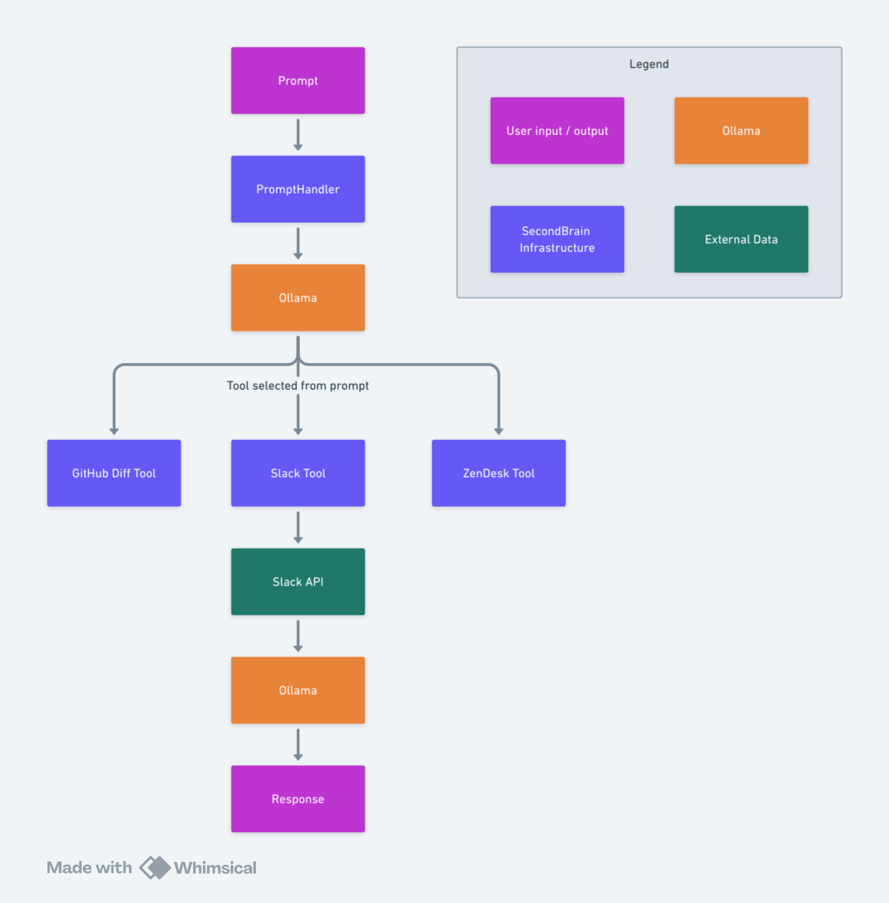

# SecondBrain

Imagine a world where you can have a conversation with your data. SecondBrain is a framework that allows you to do just
that by linking plain text prompts with external data sources, commonly referred to as Retrieval Augmented Generation
(RAG). The resulting context is then presented an LLM to provide the information it needs to answer your questions.

This means you can ask a question like:

> Highlight the important changes made since October 1 2024 in the GitHub repository "SecondBrain" owned by "mcasperson"

and get a meaningful response against real-time data.


## GitHub Actions

SecondBrain is available as a GitHub Action. This allows you to generate summaries of your git diffs as part of a GitHub Actions Workflow.

The action is distributed as the Docker image `ghcr.io/mcasperson/secondbrainaction`.

Here is an example of how to use the action:

```yaml
steps:
  - name: SecondBrainAction
    id: secondbrain
    uses: mcasperson/SecondBrain@main
    with:
        prompt: 'Provide a summary of the changes from the git diffs. Use plain language. You will be penalized for offering code suggestions. You will be penalized for sounding excited about the changes.'
        token: ${{ secrets.GITHUB_TOKEN }}
        owner: ${{ github.repository_owner }}
        repo: ${{ github.repository }}
        sha: ${{ github.sha }}
  # Access the LLM response
  - name: Get the diff summary
    run: echo "The time was ${{ steps.secondbrain.outputs.response }}"
```

| Input    | Description                                                                                  | Mandatory | Default                                                                                                                                                                        |
|----------|----------------------------------------------------------------------------------------------|-----------|--------------------------------------------------------------------------------------------------------------------------------------------------------------------------------|
| `prompt` | The prompt to use to generate the summary.                                                   | No        | A default prompt is used to generate summaries of the git diffs. See [action.yml](https://github.com/mcasperson/SecondBrain/blob/main/action.yml) for the exact default value. |
| `token`  | The GitHub token to use to access the repository. Set this to `${{ secrets.GITHUB_TOKEN }}`. | Yes       | None                                                                                                                                                                           |
| `owner`  | The owner of the repository.                                                                 | No        | `${{ github.repository_owner }}`                                                                                                                                               |
| `repo`   | The name of the repository.                                                                  | No        | `${{ github.repository }}`                                                                                                                                                     |
| `sha`    | The commit SHA to generate the summary for.                                                  | No        | `${{ github.sha }}`                                                                                                                                                            |

| Output    | Description                                                                                   |
|-----------|-----------------------------------------------------------------------------------------------|
| `response` | The response generated by the LLM. This is the summary of the git diffs.                     |

## Awards

SecondBrain was awarded second place in the [Payara Hackathon - Generative AI on Jakarta EE](https://www.linkedin.com/posts/payara_the-power-up-your-jakarta-ee-with-ai-hackathon-activity-7275895257563607040-lOnn?utm_source=share&utm_medium=member_desktop)!


## How does it work?

An example usage of SecondBrain is a prompt like this:

```
Summarize 7 days worth of messages from the #announcements channel in Slack
```

This prompt is handled like this:

1. The prompt is passed to Ollama which selects the `secondbrain.tools.SlackChannel` tool. This is commonly referred to
   as [tool or function calling](https://www.llama.com/docs/model-cards-and-prompt-formats/llama3_2/#-tool-calling-(1b/3b)-).
2. Ollama also extracts the channel name `#announcements` and days `7` from the prompt as an argument.
3. The `secondbrain.tools.SlackChannel` tool is called with the argument `#announcements` and `7`.
4. The tool uses the Slack API to find messages from the last `7` days in the `#announcements` channel.
5. The messages are placed in the context of the original prompt and passed back to Ollama.
6. Ollama answers the prompt with the messages context and returns the result to the user.



Meta-tools call multiple tools and collate the context to be passed to the LLM to generate a response. This allows
SecondBrain to answer complex questions that require data from multiple sources.


## Annotations

The results generated by SecondBrain include annotations that link the source information to the response generated by
the LLM. This helps to solve the common problem when using LLMs where you can not be sure why it provided the answer
that it did. By annotating the response with links to the source information, you can quickly verify the answer by
confirming the source information.


Matching the LLMs answer to the source is done by converting sentences to vectors with a model
like [all-MiniLM-L6-v2](https://huggingface.co/sentence-transformers/all-MiniLM-L6-v2). When sentences in the source and
the response are close, the source is annotated.


## Technologies used

SecondBrain makes heavy use of Jakarta EE and MicroProfile, executed in a Docker image using Payara Micro.

## Running the application

Secondbrain is distributed as a Docker image and run in parallel with Ollama using Docker Compose:

1. `git clone https://github.com/mcasperson/SecondBrain.git` to clone the repository
2. `cd SecondBrain` to enter the project directory
3. `docker compose up` to start the Docker Compose stack
4. `docker exec secondbrain-ollama-1 ollama pull llama3.2` to pull the `llama3.2` LLM. This is used by the queries.
4. `docker exec secondbrain-ollama-1 ollama pull llama3.1` to pull the `llama3.1` LLM. This is used by tool selection.
5. Create
   a [GitHub access token](https://docs.github.com/en/authentication/keeping-your-account-and-data-secure/managing-your-personal-access-tokens)
6. Open https://localhost:8181, paste in your access token, and click `Submit` to answer the default query
7. Optional: Run `docker exec secondbrain-ollama-1 ollama ps` to see the status of the Ollama service

## Running the CLI

The CLI is useful when you want to automate SecondBrain, usually to run it on a schedule. For example,
you could summarize a Slack channel every week with a command like:

```bash
java \
  -Dsb.ollama.toolmodel=llama3.1 \
  -Dsb.ollama.model=gemma2 \
  -Dsb.ollama.contextlength=32000 \
  -Dstdout.encoding=UTF-8 \
  -jar secondbrain.jar \
  "Given 1 days worth of ZenDesk tickets to recipient \"support@example.org\" provide a summary of the questions and problems in the style of a news article with up to 7 paragraphs. You must carefully consider each ticket when generating the summary. You will be penalized for showing category percentages. You will be penalized for including ticket IDs or reference numbers. Use concise, plain, and professional language. You will be penalized for using emotive or excited language. You will be penalized for including a generic final summary paragraph. You must only summarize emails that are asking for support. You will be penalized for summarizing emails that are not asking for support. You will be penalized for summarizing marketing emails. You will be penalized for attempting to answer the questions. You will be penalized for using terms like flooded, wave, or inundated. You will be penalized for including an introductory paragraph."
```

[ZendeskSendToSlack.ps1](scripts/ZendeskSendToSlack.ps1) is an example PowerShell script that executes the CLI. This
script is run with using Windows Task Scheduler with the command:

```PowerShell
pwsh.exe -file "C:\path\to\ZendeskSendToSlack.ps1"
```

## Practical applications

SecondBrain excels at generating reports from unstructured data. Because local LLMs are quite slow (unless you happen to
have a collection of high end GPUs), these reports can be generated as part of a batch job using the CLI tool. This
allows you to run SecondBrain overnight and review the report in the morning.

The `scripts` directory contains many examples of these kind of reports generated as part of a PowerShell script and run
as a scheduled task.

Some examples include:

* Summarize the last week's worth of messages in a Slack channel
* Generate a summary of the last week's worth of ZenDesk tickets
* Create a report highlighting the changes in a GitHub repository

## Project Structure

The project is split into modules:

* `secondbrain-core` which contains shared utilities and interfaces used by all other modules.
* `secondbrain-service` which orchestrates the function calling with the LLM.
* `secondbrain-tools` which contains the tools that interact with external data sources.
* `secondbrain-web` which is a web interface for interacting with the service.
* `secondbrain-cli` which is a CLI tool for interacting with the service.


## Model selection

SecondBrain supports switching between different LLMs by changing the `sb.ollama.model` configuration value. The
following models are supported:

* `llama3.1` - Facebook's open source LLM.
* `llama3.2` - Facebook's open source LLM.
* `gemma2` - Google's open source LLM model.
* `phi3` - Microsoft's Phi model.
* `qwen2` - Alibaba's Qwen model.

Support for new models requires implementing the `secondbrain.domain.prompt.PromptBuilder` interface.

Note that the function calling feature of SecondBrain only supports `llama3.1` and `llama3.2` models. Function calling
is configured via the `sb.ollama.toolmodel` configuration value.

## Configuration

SecondBrain is configured via MicroProfile Config. Note that MicroProfile allows these configuration values to be set
via [a number of different locations](https://smallrye.io/smallrye-config/Main/config/getting-started/), including
environment variables, system properties, and configuration files:

* `sb.slack.clientid` - The Slack client ID
* `sb.slack.clientsecret` - The Slack client secret
* `sb.zendesk.accesstoken` - The ZenDesk token
* `sb.zendesk.user` - The ZenDesk user
* `sb.zendesk.url` - The ZenDesk url
* `sb.google.serviceaccountjson` - The Google service account JSON file used to authenticate with Google APIs
* `sb.ollama.url` - The URL of the Ollama service. (defaults to http://localhost:11434)
* `sb.ollama.model` - The model to use in Ollama. Supports `llama3.x`, `gemma2`, `phi3`, `qwen2`. See classes that
  implement `secondbrain.domain.prompt.PromptBuilder`. (defaults to `llama3.2`)
* `sb.ollama.toolmodel` - The model to use in Ollama to select a tool. This only supports llama3 models (i.e. `llama3.1`
  or `llama3.2`). (defaults to `llama3.2`)
* `sb.ollama.contentlength` - The content window length to use in Ollama. (defaults to `7000 * 4`, where each token is
  assumed to be 4 characters)
* `sb.encryption.password` - The password to use for encrypting sensitive data stored by web clients. (defaults to
  `12345678`)
* `sb.tools.debug` - Whether to log debug information about the tool in the response. (defaults to `false`)

## Google login

The `GoogleDocs` tool can
use [Application Default Credentials](https://cloud.google.com/docs/authentication/application-default-credentials) to
authenticate with Google APIs. To set this up, you need to run the following command:

```bash
gcloud auth application-default login --scopes https://www.googleapis.com/auth/documents.readonly,https://www.googleapis.com/auth/cloud-platform --client-id-file ~/Downloads/client.json
```

## Testing

* Install Ollama locally
* Pull the `llama3.2` model with the command `ollama pull llama3.2`
* Pull the `llama3.1` model with the command `ollama pull llama3.1`
* Build and install all the modules with command `mvn clean install`
* Start Payara Micro with the command `cd web; mvn package; mvn payara-micro:start`
* Create
  a [GitHub access token](https://docs.github.com/en/authentication/keeping-your-account-and-data-secure/managing-your-personal-access-tokens)
* Open [https://localhost:8181/index.html](https://localhost:8181/index.html) in a browser, paste in the access token,
  and run the default query

## New Tools

See the `secondbrain.tools.HelloWorld` tool for an example of how to create a new tool.