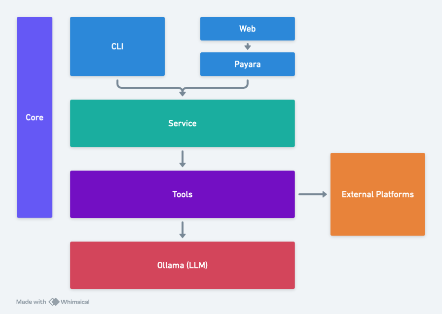

SecondBrain is a CLI tool to access and filter data from external data sources such as Salesforce, 
ZenDesk, Slack, Gong and others, and then query that data using an LLM.

This tool uses Retrieval Augmented Generation (RAG) techniques to pull in relevant data from external sources, 
filter it based on keywords, and then pass that data to a Large Language Model (LLM) for analysis.

This is useful for generating reports, summaries, and insights from multiple and otherwise disconnected 
data sources.

## Building

Clone the git repository:

```bash
git clone https://github.com/mcasperson/SecondBrain.git
```

Build the project using Maven:

```bash
./mvnw clean package -DskipTests
```

## Directory Scan Example

The directory scan tools allows you to scan a directory of files for keywords, extract relevant text, and then ask questions about the data found. This is useful when you need to analyze a collection of documents, such as PDFs, Word documents, or text files.

Run the `DirectoryScan` tool against the PDF files in the `samples` directory, looking for keywords "AI", "Kubernetes", and "K8s", and then ask a question about the data found. 
Replace the `replaceme` values with your Azure AI Foundry API key and endpoint URL, and also replace `Phi-4` with the model you wish to use:

```bash
java \
    "-Dsb.llm.client=azure" \
    "-Dsb.azurellm.apikey=replaceme" \
    "-Dsb.azurellm.model=Phi-4" \
    "-Dsb.azurellm.url=https://replaceme.services.ai.azure.com/models/chat/completions?api-version=2024-05-01-preview" \
    "-Dsb.tools.force=DirectoryScan" \
    "-Dsb.directoryscan.directory=samples" \
    "-Dsb.directoryscan.keywords=AI,Kubernetes,K8s" \
    -jar cli/target/secondbrain-cli-1.0-SNAPSHOT.jar \
    "What percentage of AI deployments use Kubernetes or K8s for orchestration?"
```

This command runs the example with Ollama:

```bash
ollama pull nemotron-3-nano:30b
java \
    "-Dsb.llm.client=ollama" \
    "-Dsb.ollama.model=nemotron-3-nano:30b" \
    "-Dsb.tools.force=DirectoryScan" \
    "-Dsb.directoryscan.directory=samples" \
    "-Dsb.directoryscan.keywords=AI,Kubernetes,K8s" \
    -jar cli/target/secondbrain-cli-1.0-SNAPSHOT.jar \
    "What percentage of AI deployments use Kubernetes or K8s for orchestration?"
```

## GitHub Diff Example

```bash
java \
    "-Dsb.llm.client=azure" \
    "-Dsb.azurellm.apikey=replaceme" \
    "-Dsb.azurellm.url=https://replaceme.services.ai.azure.com/models/chat/completions?api-version=2024-05-01-preview" \
    "-Dsb.azurellm.model=Phi-4" \
    "-Dsb.tools.force=GitHubDiffs" \
    "-Dsb.github.owner=mcasperson" \
    "-Dsb.github.repo=SecondBrain" \
    "-Dsb.github.days=30" \
    -jar cli/target/secondbrain-cli-1.0-SNAPSHOT.jar \
    "Write a 3 paragraph summary of the changes made to the SecondBrain project in the last 30 days."
```

```bash
java \
    "-Dsb.llm.client=ollama" \
    "-Dsb.ollama.model=nemotron-3-nano:30b" \
    "-Dsb.tools.force=GitHubDiffs" \
    "-Dsb.github.owner=mcasperson" \
    "-Dsb.github.repo=SecondBrain" \
    "-Dsb.github.days=30" \
    -jar cli/target/secondbrain-cli-1.0-SNAPSHOT.jar \
    "Write a 3 paragraph summary of the changes made to the SecondBrain project in the last 30 days."
```

## YouTube Transcript Example

This example downloads the transcripts from videos from a 
[YouTube playlist](https://www.youtube.com/watch?v=ceV3RsG946s&list=PLlrxD0HtieHgFYS4DKbJ_xCYNE94ZLJjj) 
trims the transcripts to the keywords, and then generates a summary of the AI related news from those videos.

Note that this is a fairly slow process as the YouTube API is heavily rate limited. We process 2 videos a minute, 
so this command may take up to 5 minutes to complete:

```bash
java \
    "-Dsb.llm.client=azure" \
    "-Dsb.azurellm.apikey=replaceme" \
    "-Dsb.azurellm.url=https://replaceme.services.ai.azure.com/models/chat/completions?api-version=2024-05-01-preview" \
    "-Dsb.azurellm.model=Phi-4" \
    "-Dsb.tools.force=YoutubePlaylist" \
    "-Dsb.youtube.playlistId=PLlrxD0HtieHgFYS4DKbJ_xCYNE94ZLJjj" \
    "-Dsb.youtube.maxvideos=10" \
    "-Dsb.youtube.keywords=AI,LLM,MCP,Agent" \
    -jar cli/target/secondbrain-cli-1.0-SNAPSHOT.jar \
    "Write a 3 paragraph summary of the AI related news from the YouTube videos."
```

This is the same command using Ollama:

```bash
ollama pull nemotron-3-nano:30b
java \
    "-Dsb.llm.client=ollama" \
    "-Dsb.ollama.model=nemotron-3-nano:30b" \
    "-Dsb.tools.force=YoutubePlaylist" \
    "-Dsb.youtube.playlistId=PLlrxD0HtieHgFYS4DKbJ_xCYNE94ZLJjj" \
    "-Dsb.youtube.maxvideos=10" \
    "-Dsb.youtube.keywords=AI,LLM,MCP,Agent" \
    -jar cli/target/secondbrain-cli-1.0-SNAPSHOT.jar \
    "Write a 3 paragraph summary of the AI related news from the YouTube videos."
```

## ZenDesk Example

The `ZenDeskOrganization` tool connects to a ZenDesk instance, retrieves support tickets from the specified
number of days, and passes the relevant data to the LLM for analysis.

Here is the command using Azure AI Foundry. Replace the `replaceme` values with your Azure AI Foundry API 
key and endpoint URL, and also replace `Phi-4` with the model you wish to use:

```bash
java \
    "-Dsb.llm.client=azure" \
    "-Dsb.azurellm.apikey=replaceme" \
    "-Dsb.azurellm.url=https://replaceme.services.ai.azure.com/models/chat/completions?api-version=2024-05-01-preview" \
    "-Dsb.azurellm.model=Phi-4" \
    "-Dsb.tools.force=ZenDeskOrganization" \
    "-Dsb.zendesk.url=https://replaceme.zendesk.com" \
    "-Dsb.zendesk.user=replaceme@replaceme.org" \
    "-Dsb.zendesk.accesstoken=replaceme" \
    "-Dsb.zendesk.days=30" \
    -jar cli/target/secondbrain-cli-1.0-SNAPSHOT.jar \
    "Summarize the top customer support issues from the last 30 days."
```

Here is the command using Ollama:

```bash
ollama pull nemotron-3-nano:30b
java \
    "-Dsb.llm.client=ollama" \
    "-Dsb.ollama.model=nemotron-3-nano:30b" \
    "-Dsb.tools.force=ZenDeskOrganization" \
    "-Dsb.zendesk.url=https://replaceme.zendesk.com" \
    "-Dsb.zendesk.user=replaceme@replaceme.org" \
    "-Dsb.zendesk.accesstoken=replaceme" \
    "-Dsb.zendesk.days=30" \
    -jar cli/target/secondbrain-cli-1.0-SNAPSHOT.jar \
    "Summarize the top customer support issues from the last 30 days."
```

## Gong Example

The `Gong` tool connects to a Gong instance, retrieves sales calls from the specified
number of days, and passes the relevant data to the LLM for analysis.

Here is the command using Azure AI Foundry. Replace the `replaceme` values with your Azure AI Foundry API
key and endpoint URL, and also replace `Phi-4` with the model you wish to use:

```bash
java \
    "-Dsb.llm.client=azure" \
    "-Dsb.azurellm.apikey=replaceme" \
    "-Dsb.azurellm.url=https://replaceme.services.ai.azure.com/models/chat/completions?api-version=2024-05-01-preview" \
    "-Dsb.azurellm.model=Phi-4" \
    "-Dsb.tools.force=Gong" \
    "-Dsb.gong.url=https://api.gong.io" \
    "-Dsb.gong.accessKey=replaceme" \
    "-Dsb.gong.accessSecretKey=replaceme" \
    "-Dsb.gong.days=30" \
    "-Dsb.gong.company=replaceme" \
    -jar cli/target/secondbrain-cli-1.0-SNAPSHOT.jar \
    "Summarize the common topics discussed in the last 30 days."
```

```bash
ollama pull nemotron-3-nano:30b
java \
    "-Dsb.llm.client=ollama" \
    "-Dsb.ollama.model=nemotron-3-nano:30b" \
    "-Dsb.tools.force=Gong" \
    "-Dsb.gong.url=https://api.gong.io" \
    "-Dsb.gong.accessKey=replaceme" \
    "-Dsb.gong.accessSecretKey=replaceme" \
    "-Dsb.gong.days=30" \
    "-Dsb.gong.company=replaceme" \
    -jar cli/target/secondbrain-cli-1.0-SNAPSHOT.jar \
    "Summarize the common topics discussed in the last 30 days."
```
    
## Meta Tool Example

The `Meta` tool combines the results of multiple tools into a single report. 
This is useful when you need to aggregate data from multiple sources and then ask questions about the 
combined data.

In this example we combine the `YoutubePlaylist` and `DirectoryScan` tools to generate a 
summary of AI related news from both YouTube videos and PDF reports in the `samples` directory.

Note the use of the `contextMetaField` and `contextMetaPrompt` parameters to add additional context to the report.
The results of the prompts are captured in the file called `meta.json` which can be reviewed after the command completes.
This is useful when the results of this operation are consumed by another process. For example, you could build
a report that indicated which documents mentioned Python or Kubernetes based on the results of the context meta prompts:

```bash
ollama pull nemotron-3-nano:30bs
java \
     "-Dsb.llm.client=ollama" \
     "-Dsb.ollama.model=nemotron-3-nano:30b" \
     "-Dsb.ollama.contextwindow=100000" \
     "-Dsb.tools.force=Meta" \
     "-Dsb.meta.toolNames=YoutubePlaylist,DirectoryScan" \
     "-Dsb.meta.metareport=meta.json" \
     "-Dsb.meta.contextMetaField1=Python" \
     "-Dsb.meta.contextMetaPrompt1=Does the content describe anything related to the Python programming language?" \
     "-Dsb.meta.contextMetaField2=Kubernetes" \
     "-Dsb.meta.contextMetaPrompt2=Does the content describe anything related to Kubernetes?" \
     "-Dsb.youtube.playlistId=PLlrxD0HtieHgFYS4DKbJ_xCYNE94ZLJjj" \
     "-Dsb.youtube.maxvideos=10" \
     "-Dsb.youtube.keywords=AI,LLM,MCP,Agent" \
     "-Dsb.directoryscan.directory=samples" \
     "-Dsb.directoryscan.keywords=AI,Kubernetes,K8s" \
     -jar cli/target/secondbrain-cli-1.0-SNAPSHOT.jar \
     "Write a 3 paragraph summary of the AI related news from the YouTube videos and PDF reports."
```

## Extra logging

To enable more verbose logging, you must create a file like the following:

```properties
# Edd the console handler
handlers = java.util.logging.ConsoleHandler
# Enabling FINE level logging
java.util.logging.ConsoleHandler.level=FINE
# Infrastructure classes interact with external systems
secondbrain.infrastructure.level=FINE
# Tools are responsible for integrating the external systems with the LLM
secondbrain.domain.tools.level=FINE
```

Then reference that file using the `java.util.logging.config.file` system property:

```bash
java \
    "-Djava.util.logging.config.file=logging.properties" \
    "-Dsb.llm.client=azure" \
    "-Dsb.azurellm.apikey=replaceme" \
    "-Dsb.azurellm.model=Phi-4" \
    "-Dsb.azurellm.url=https://replaceme.services.ai.azure.com/models/chat/completions?api-version=2024-05-01-preview" \
    "-Dsb.tools.force=DirectoryScan" \
    "-Dsb.directoryscan.directory=samples" \
    "-Dsb.directoryscan.keywords=AI,Kubernetes,K8s" \
    -jar cli/target/secondbrain-cli-1.0-SNAPSHOT.jar \
    "What percentage of AI deployments use Kubernetes or K8s for orchestration?"
```

## Project Structure

The project is split into modules:

* `secondbrain-core` which contains shared utilities and interfaces used by all other modules.
* `secondbrain-service` which orchestrates the function calling with the LLM.
* `secondbrain-tools` which contains the tools that interact with external data sources.
* `secondbrain-web` which is a web interface for interacting with the service.
* `secondbrain-cli` which is a CLI tool for interacting with the service.

